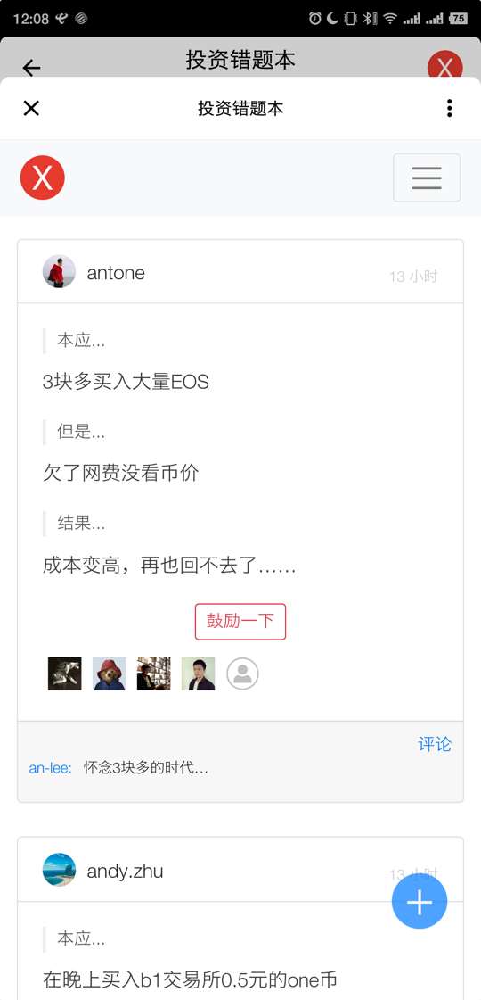
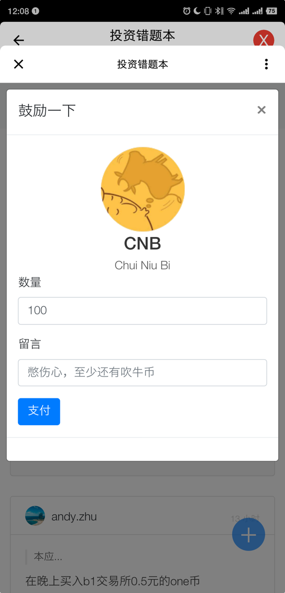
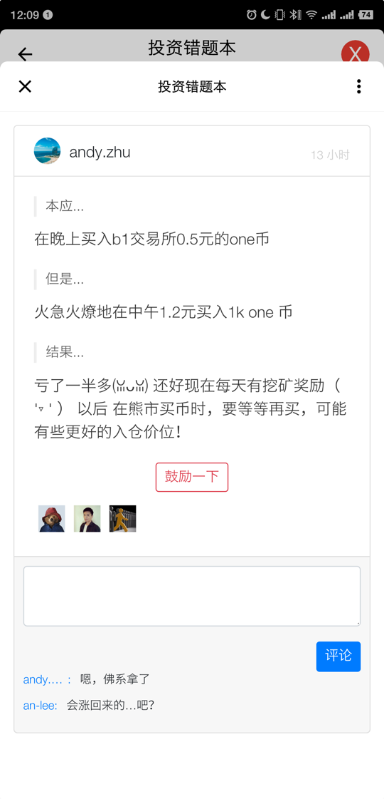

# 投资错题本


Mixin ID: **7000101410**

链接：[点击我](https://mixin.one/codes/7e44f5da-a30c-47e4-9293-2501320127c5)

## 简介

一个 Rails 实现的 Mixin 机器人**玩具项目** : [投资错题本](https://mixin.one/codes/7e44f5da-a30c-47e4-9293-2501320127c5) 的源代码。

## 初始化项目

### setp 1 注册 Mixin 机器人

到[这里](https://developers.mixin.one/dashboard)注册你的机器人，注册完毕后生成相关配置参数。

> Click to generate a new secret
>
> Click to generate a new session

得到的参数包括：

- CLIENT_ID
- CLIENT_SECRET
- PIN_CODE
- SESSION_ID
- PIN_TOKEN
- PRIVATE_KEY

配置回调网址 `The OAuth redirect uri`。

例如，如果是本地测试环境，可以配置为

```
http://localhost:3000/auth/mixin/callback
```

### step 2 项目初始化

```
bin/setup
cp config/application.yml.example config/application.yml
cp config/database.yml.example config/database.yml
```

### step 3 配置 Mixin 参数

将 step 1 中得到的参数替换到 `config/application.yml` 中。

### step 4 测试 Mixin Network

以 `config/application.yml.example` 中配置的 Bot4Debug 机器人为例。

`rails c` 进入控制器，运行

```
MixinBot.api.read_me
```

如果一切顺利，应该会得到以下结果

```
{"data"=>{"type"=>"user", "user_id"=>"0508a116-1239-4e28-b150-85a8e3e6b400", "identity_number"=>"7000101439", "full_name"=>"Bot4Debug", "avatar_url"=>"https://images.mixin.on
e/dJvEiXAfsr0TezbL-T_Pb4O3NYHrxwf8asBv_ne1CqhH5Iyll9ldBno2XVYXoe4ieCna1oNvDmfjuFoDHMMvnQ=s256", "relationship"=>"ME", "mute_until"=>"0001-01-01T00:00:00Z", "created_at"=>"2018-07
-08T01:03:14.331430468Z", "is_verified"=>false, "app"=>{"type"=>"app", "app_id"=>"0508a116-1239-4e28-b150-85a8e3e6b400", "app_number"=>"7000101439", "redirect_uri"=>"http://local
host:3000/auth/mixin/callback", "home_uri"=>"http://localhost:3000/", "name"=>"Bot4Debug", "icon_url"=>"https://images.mixin.one/dJvEiXAfsr0TezbL-T_Pb4O3NYHrxwf8asBv_ne1CqhH5Iyll
9ldBno2XVYXoe4ieCna1oNvDmfjuFoDHMMvnQ=s256", "description"=>"a bot for debug locally", "capabilites"=>["CONTACT"], "app_secret"=>"$2a$10$p/kXG4.HQEY3DHO0fCw68ORoO5unvMdv6fTibumY.
KcG5NtaboUVO", "creator_id"=>"7ed9292d-7c95-4333-aa48-a8c640064186"}, "session_id"=>"a74d1cb7-50ca-427f-84ef-e05681a4850d", "phone"=>"0508a116-1239-4e28-b150-85a8e3e6b400", "pin_
token"=>"", "invitation_code"=>"", "code_id"=>"324677ec-0509-49df-8008-ed0d5a4c351d", "code_url"=>"https://mixin.one/codes/324677ec-0509-49df-8008-ed0d5a4c351d", "has_pin"=>true,
 "receive_message_source"=>"EVERYBODY", "accept_conversation_source"=>"EVERYBODY"}}
```

## 主要功能

* Mixin 登录
* 记录投资错误
* 评论
* 打赏

## 截图







## 技术栈

* Ruby on Rails 5.2
* bootstrap 4
* postgres

## 参考资料

- [Mixin Nexwork 官方文档](https://developers.mixin.one/api)
- [MixinBot](https://github.com/an-lee/mixin_bot)

## License

This project rocks and uses MIT-LICENSE.
